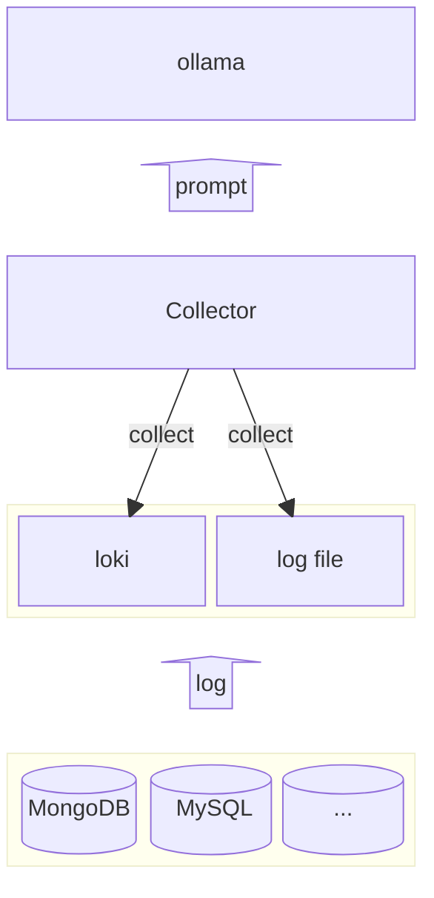

# insights
A slow query log analyzer tool based on llm.

## TODO

- [x] Command Line Integration
- [ ] Ollama Integration
- [ ] Add support for MongoDB
- [ ] Add support for MySQL
- [ ] Loki Integration

# 🤝 Thanks
This tool is built with the help of the following projects:
- [ollama](https://github.com/ollama/ollama)
- [bubbletea](https://github.com/charmbracelet/bubbletea)
- [cobra](github.com/spf13/cobra)
