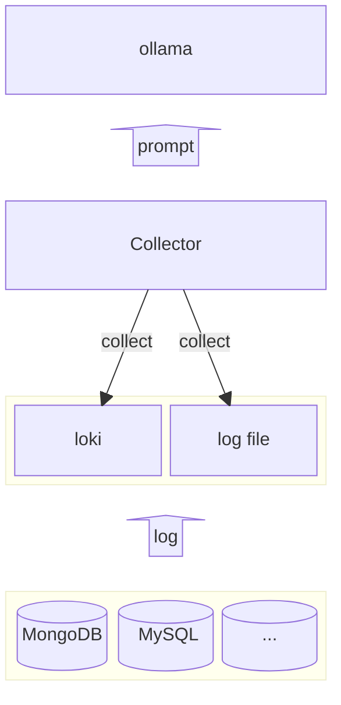

# Insight

>  Slow Query Insight

## 总体流程

```mermaid
block-beta
columns 1

ollama

prompt<["prompt"]>(up)  

Collector
space
block:logs
loki
logfile["log file"]
end

Collector -- "collect" --> loki
Collector -- "collect" --> logfile

log<["log"]>(up)  

block:Databases
MongoDB[("MongoDB")]
MySQL[("&nbsp;&nbsp;&nbsp;MySQL&nbsp;&nbsp;")]    OtherDatabases[("&nbsp;&nbsp;&nbsp;&nbsp;&nbsp;&nbsp;&nbsp;...&nbsp;&nbsp;&nbsp;&nbsp;&nbsp;&nbsp;&nbsp;")]
end


```

## 命令行交互设计

与pprof工具类似

